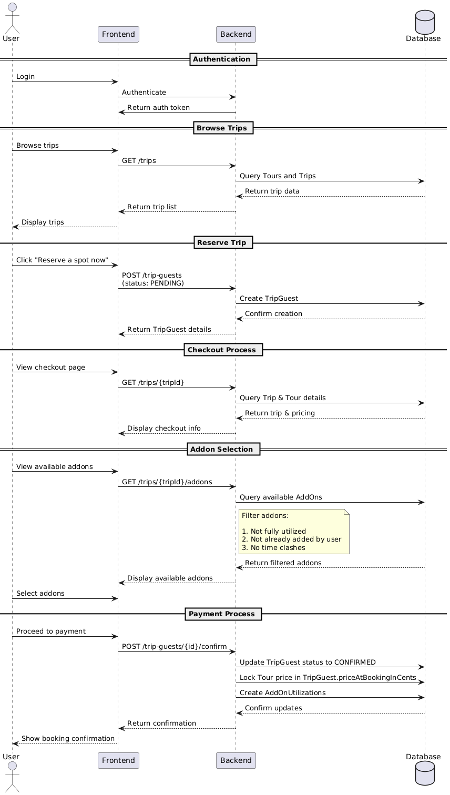
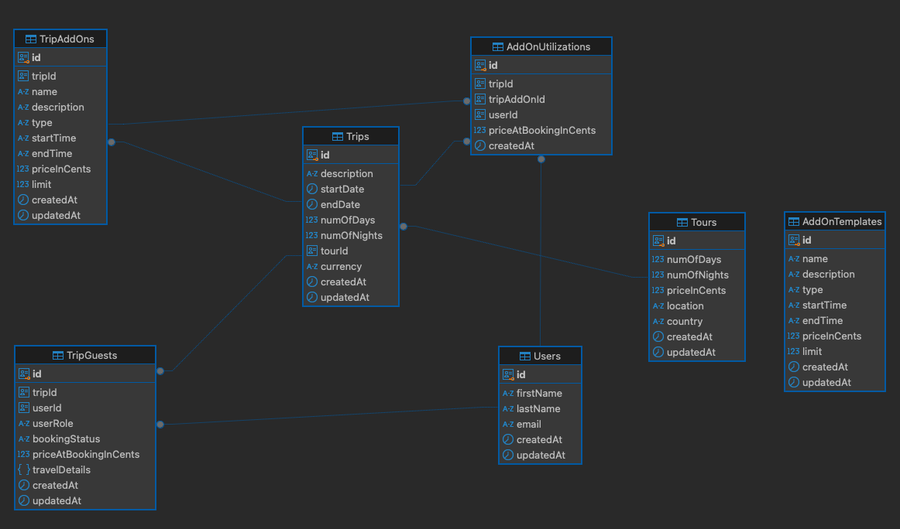

# Tourhero assignment

## Staging environment (deployed on Vercel with Postgres on Neon)

Frontend: https://tourhero-frontend.vercel.app/
Backend: https://tourhero-backend.vercel.app/api/

## User Flow

1. User logs in.
2. User browses through a list of trips (stored in trips).
   - Prior to this, a Host would have created a trip from a list of Tours, which serve as templates for the Trip.
   - Data in Tours are dynamic (e.g., pricing can change when booked at different times if a dynamic pricing mechanism is applied).
3. Once the user expresses interest in a tour by pressing “Reserve a spot now”, a TripGuest is created with a pending status.
4. User sees the checkout page and fetches the corresponding Trip details (pricing will come from Tour) since the payment has not been made and the price is not locked in yet.
5. User also sees available addons applicable to the trip.
   - Trip addons should be preconfigured by the host using AddOnTemplates when creating a Trip from a Tour.
     - AddOnTemplates store preconfigured sets of AddOn details that can be prepopulated to TripAddOn but hold no link between the different entities (it essentially helps the Host configure the respective TripAddOn faster).
   - This limits the number of addons for the particular trip (e.g., only X number of room upgrades per trip).
   - Available addons will filter out:
     1. Addons that have been fully utilized for the trip.
     2. Addons that have been added by the user to the specified trip previously (there should be a page for the user to view/manage their addons in case they want to add more).
     3. Addons with start/end times that clash with any of their existing time-based addons.
6. User can proceed to make payment.
   - The server will update TripGuest to Confirmed and lock in the current price of the Tour in priceAtBookingInCents.
   - Note that even if addons are selected, the price will not be added to TripGuest.priceAtBookingInCents (probably can be renamed to make it clear it is the price for the Tour only).
   - Addons will be separately tracked under AddOnUtilizations, which track the associated TripAddOn, User, Trip, and priceAtBookingInCents for the respective addons.
   - To see the total price of the trip with addons for a user, add TripGuest.priceAtBookingInCents and the sum of AddOnUtilizations.priceAtBookingInCents.

## Database schema

ER diagram 

## Hacks

- Based on the suggested user flow, there should be a list of trips for the user to reserve a spot and checkout.
  - The list would provide the tripId, which can be appended to the query param and used as an identifier to fetch the right trip.
  - Since there is no login mechanism in place, it is currently not possible to uniquely identify a person on the frontend.
  - On the frontend, I added a query param of offset to fetch TripGuest with offset to allow fetching of different TripGuests.

## Responsive Design

- Some slight rearrangement of the checkout page component was done to cater mainly to mobile and laptop sizes.

## Areas for Improvement

- Current implementation does not consider the limit for time-based addons. Only time clash detection logic is implemented
- Better test coverage for critical flows:
  - Filtering of available addons (which will involve integration test with database)
    - Transactional controlled test and rolled back at the end of each test to speed up clean up
  - Clash detection for time-based add-ons :heavy_check_mark:
- Better code organization on the server (controller, service, repository layer).
- Indexes on many-to-many relationship tables (e.g., unique index on AddOnUtilization User-TripAddon to prevent one user from purchasing the same add on for the same trip multiple times).
- Enum tables for the statuses/record types in the respective tables instead of just plain strings.
- Error boundary for on both the root of frontend project as well as each component (e.g. error on addons component shouldn't affect the checkout/payment flow)
- AddOnUtilization can potentially store numbers (e.g., multiple addons for a sim card).

## Setting Up Locally for Development

#### Version used

- Node v22.7.0
- Bun v1.1.18
- Local Postgres v16.3 (change the configuration in .env to point to the local Postgresql database).
